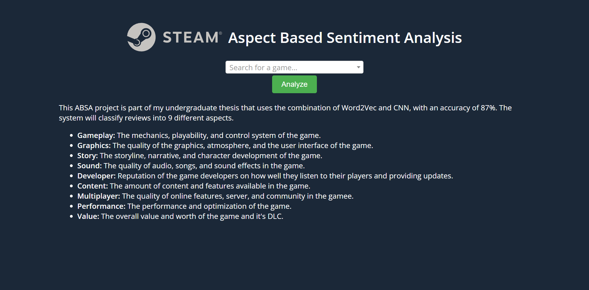
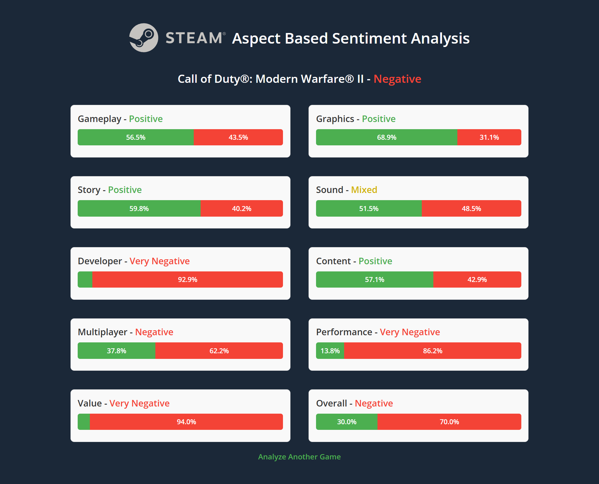
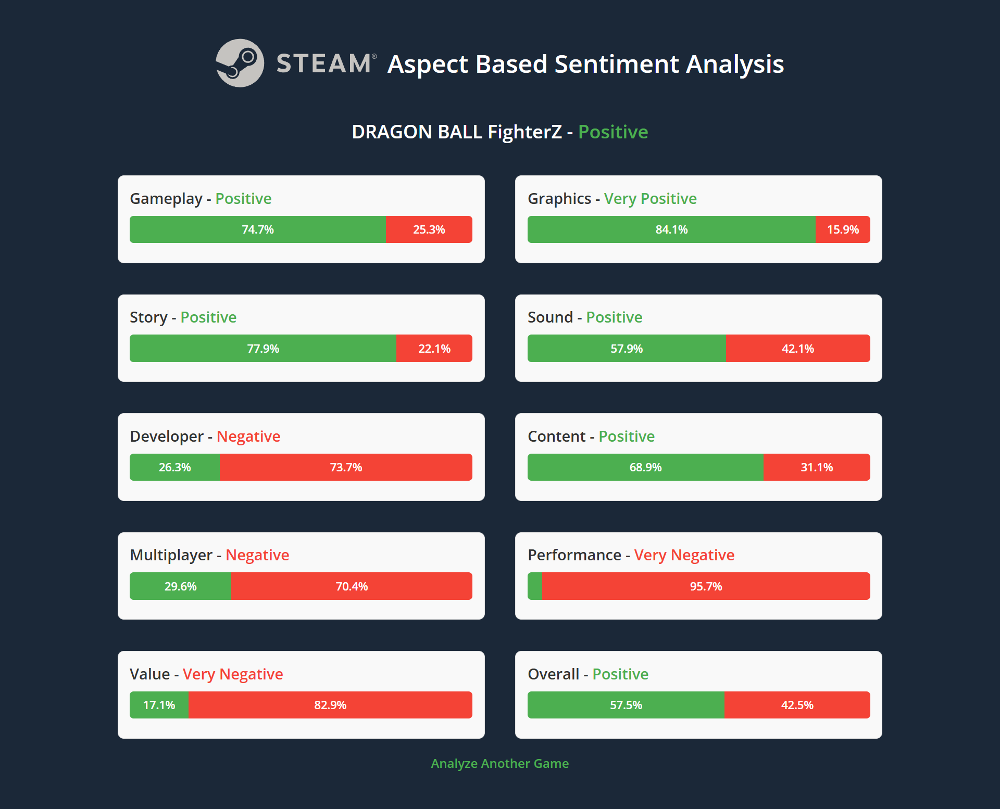
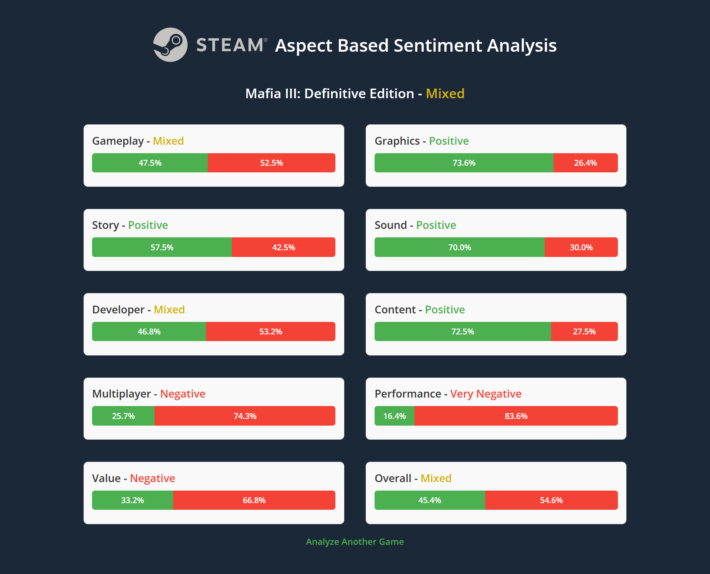

# Steam Aspect Based Sentiment Analysis Web App
This Aspect Based Sentiment Analysis (ABSA) project is part of my undergraduate thesis where I created ABSA model using Convolutional Neural Networks (CNN) and compared it with the Long Short-Term Memory (LSTM).

The system will classify reviews into 9 different aspects:

1. Gameplay: The mechanics, playability, and control system of the game.
2. Graphics: The quality of the graphics, atmosphere, and the user interface of the game.
3. Story: The storyline, narrative, and character development of the game.
4. Sound: The quality of audio, songs, and sound effects in the game.
5. Developer: Reputation of the game developers on how well they listen to their players and providing updates.
6. Content: The amount of content and features available in the game.
7. Multiplayer: The quality of online features, server, and community in the gamee.
8. Performance: The performance and optimization of the game.
9. Value: The overall value and worth of the game and it's DLC.

## Results
<table><thead>
  <tr>
    <th> </th>
    <th colspan="4">Aspect Classification</th>
    <th colspan="4">Sentiment Classification</th>
  </tr></thead>
<tbody>
  <tr>
    <td> </td>
    <td colspan="2">CNN</td>
    <td colspan="2">LSTM</td>
    <td colspan="2">CNN</td>
    <td colspan="2">LSTM</td>
  </tr>
  <tr>
    <td>Accuracy</td>
    <td colspan="2">89%</td>
    <td colspan="2">88.5%</td>
    <td colspan="2">83.6%</td>
    <td colspan="2">80.7%</td>
  </tr>
  <tr>
    <td>Precision</td>
    <td colspan="2">87.7%</td>
    <td colspan="2">87.3%</td>
    <td colspan="2">82.3%</td>
    <td colspan="2">80.1%</td>
  </tr>
  <tr>
    <td>Recall</td>
    <td colspan="2">87.6%</td>
    <td colspan="2">87.3%</td>
    <td colspan="2">82.2%</td>
    <td colspan="2">79%</td>
  </tr>
  <tr>
    <td>F1-Score</td>
    <td colspan="2">87.7%</td>
    <td colspan="2">87.2%</td>
    <td colspan="2">82.1%</td>
    <td colspan="2">79.2%</td>
  </tr>
</tbody>
</table>

## Example
The model created can be implemented into flask website, so people can enter a game name and they willl see the sentiment of each aspect.

